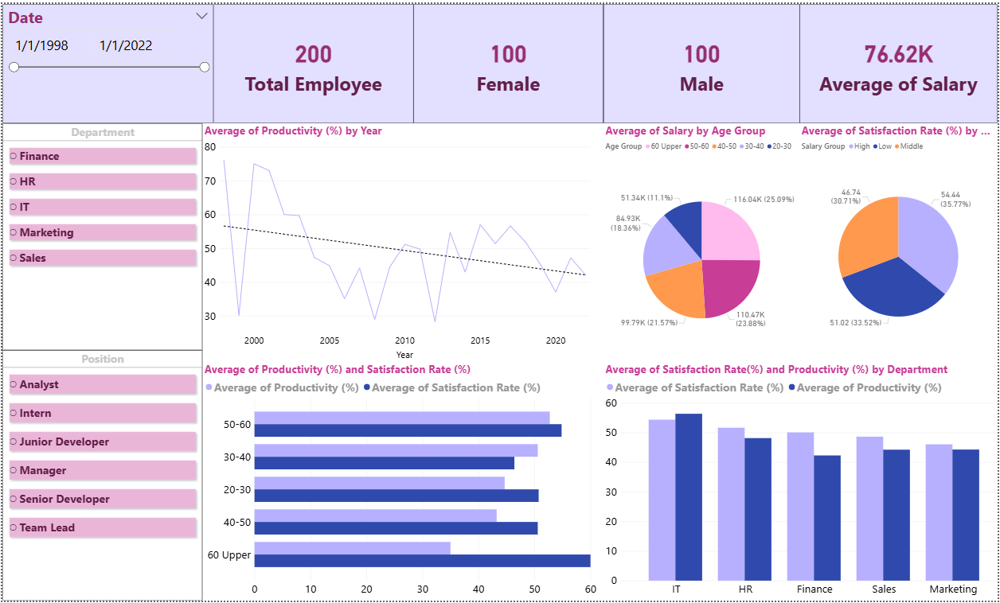

# 👥 Employee Productivity & Satisfaction Analysis (Power BI + Python)

## 📌 Project Overview

This project focuses on analyzing **employee productivity and satisfaction** using **Python for data preprocessing** and **Power BI for visualization**. The goal is to explore the relationship between productivity, satisfaction, and key factors such as **Age, Department, and Salary**, and provide actionable recommendations to improve workplace performance and employee well-being.

---

## 🎯 Objectives

* Analyze employee productivity trends over time
* Evaluate satisfaction levels across departments
* Identify key factors affecting performance and engagement
* Provide data-driven HR strategies to improve workplace efficiency

---

## 📂 Dataset

* **Source:** Employee Productivity and Satisfaction Dataset (CSV)
* **Size:** 200 employees
* **Key Features:**
  * Name, Gender, Age, Department, Position
  * Salary, Joining Date
  * Productivity (%), Satisfaction Rate
  * Feedback Score, Projects Completed

---

## 🧹 Data Preparation (Python)

### Steps:

* Imported dataset using `pandas`
* Converted **Joining Date** to datetime format
* Handled missing values in **Salary**
* Removed duplicates based on **Name**

### Feature Engineering:

* **Experience Years** (from Joining Date to present)

* **Productivity Group**

  * Low: < 50%
  * Medium: 50–80%
  * High: > 80%

* Exported cleaned dataset for Power BI

---

## 🔍 Data Exploration (Power BI)

### DAX Measures

* **Average Productivity by Department**
* **Correlation between Satisfaction Rate and Feedback Score**

### Analytical Focus

* Relationship between **Age and Projects Completed**
* Distribution by **Gender and Position**
* Department-level performance comparison

---

## 📊 Visualizations & Dashboard

### Key Visuals

* 🔥 Heatmap: Correlation between Age, Productivity, and Salary
* 📊 Bar Chart: Satisfaction Rate by Department
* 📈 Line Chart: Productivity trend over time

### Dashboard Features

* Interactive dashboard with slicers:

  * Position
  * Gender
* Drill-down insights and dynamic filtering

---

## 🖼️ Dashboard Preview



---

## 💡 Key Insights

* Company maintains **perfect gender balance (50/50)** → strong diversity advantage
* Overall **average salary: 76.6K**, indicating stable financial capacity
* Productivity shows a **declining trend over time**, suggesting inefficiencies

### Department Insights:

* **IT Department**

  * Highest productivity & satisfaction
  * Strong salary structure and growth trend
  * Core workforce: age 30–40

* **Finance Department**

  * High salary and stable performance
  * Age 40–50 group shows low satisfaction → potential risk

* **HR Department**

  * Declining productivity trend
  * Lower salary → possible cause of low performance

* **Marketing & Sales**

  * Highly volatile productivity
  * Performance depends on campaigns → lack of stability

### Demographic Insights:

* Age 30–40: Most balanced and productive group
* Age 40–50: Low satisfaction → high burnout risk
* Age 50–60: High experience but lower productivity

---

## 🚀 Recommendations

* 🔧 **Process Optimization**

  * Conduct system-wide workflow audit to improve efficiency

* 👥 **Workforce Strategy**

  * Reallocate senior employees (60+) to mentoring roles

* 🏆 **Best Practice Replication**

  * Apply IT department management strategies across teams

* 💼 **Retention Strategy (Age 30–40)**

  * Offer flexible working policies and work-life balance benefits

* 💰 **HR Department Improvement**

  * Review salary structure and incentives to boost productivity

---

## 🗂️ Project Structure

```id="emp01"
employee-productivity-analysis/
│
├── data/
│   ├── raw/
│   │   └── hr_dashboard_data.csv
│   ├── processed/
│   │   └── hr_dashboard_data_clean.csv
│
├── notebooks/
│   └── prepaired_data.ipynb
│
├── scripts/
│   └── scripts_analysis.pdf
│
├── powerBI/
│   └── dashboard.pbix
│
├── dashboard/
│   └── dashboard.png
└── README.md
```

---

## 🛠 Tools & Technologies

* Python (pandas, numpy)
* Power BI (DAX, Dashboard)
* Data Visualization & Analytics

---

## 📌 Conclusion

This project highlights the importance of combining **data analytics and HR strategy** to improve both productivity and employee satisfaction. By identifying key patterns across departments and demographics, organizations can implement targeted strategies to enhance performance and employee experience.

---

## 📎 Author

* LeNguyenKhoi
